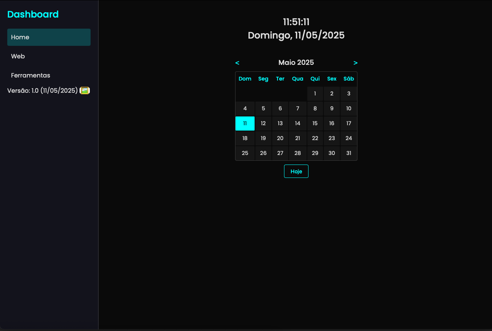

# Dashboard Web Personalizável 🌐

Um dashboard web simples para organizar links, com relógio, calendário e temas personalizáveis. Configure serviços via `services.yaml` e mude o fundo com imagens.

---

## Português 🇧🇷

### 📋 O que é?

Este dashboard web ajuda a organizar seus links favoritos em grupos, com uma interface moderna. Inclui:

- **Sidebar**: Grupos de serviços (ex.: Home, Web).
- **Relógio**: Hora e data em tempo real (fonte Poppins).
- **Calendário**: Navegação por meses, botão "Hoje" e destaque do dia atual.
- **Temas**: Claro/escuro, com fundos como `estrelas.jpg`.
- **Ícone 🖼️**: Mude o fundo ou volte ao tema padrão.

### 🚀 Como começar

#### Pré-requisitos

- Navegador (Chrome, Firefox, Edge).
- Python 3 (para servidor local).
- Git (para clonar o repositório).

#### Instalação

1. Clone o repositório:

   ```bash
   git clone https://github.com/jaymebc/dashboard.git
   cd dashboard
   ```
2. Crie pastas para imagens e ícones:

   ```bash
   mkdir backgrounds icons
   ```
3. Adicione imagens de fundo:
   - Copie `estrelas.jpg` e `fundo_claro.jpg` para `backgrounds/`.
   - Opcional: Baixe `nuvens.jpg` em Unsplash.
4. Adicione ícones:
   - Copie ou crie ícones (48x48px) em `icons/`:
     - `google.png`: Placeholder
     - `youtube.png`: Placeholder
     - Outros: `wikipedia.png`, `notion.png`, `trello.png`.

#### Executar

1. Inicie o servidor:

   ```bash
   python3 -m http.server 8000
   ```
2. Abra no navegador: `http://localhost:8000`.
3. Limpe o cache se necessário:
   - Pressione `Ctrl+Shift+Delete` &gt; "Cache de imagens e arquivos".

### 🛠️ Personalizar

#### Adicionar um fundo

1. Coloque a imagem (ex.: `nuvens.jpg`) em `backgrounds/`.
2. Edite `script.js`, função `loadBackgrounds()`:

   ```javascript
   function loadBackgrounds() {
       return [
           { file: 'fundo_claro.jpg', luminosity: 'light' },
           { file: 'estrelas.jpg', luminosity: 'dark' },
           { file: 'nuvens.jpg', luminosity: 'light' } // Novo fundo
       ];
   }
   ```
3. Reinicie o servidor, clique em 🖼️ e selecione `nuvens.jpg`.

#### Adicionar um serviço

1. Edite `services.yaml`:

   ```yaml
   groups:
     - name: Web
       services:
         - name: GitHub
           url: https://github.com
           status_url: https://github.com
           icon: github.png
   ```
2. Adicione `github.png` em `icons/` (ex.: Placeholder).
3. Reinicie o servidor e veja o serviço em "Web".

### 📂 Estrutura do projeto

```
dashboard/
├── backgrounds/
│   ├── estrelas.jpg
│   ├── fundo_claro.jpg
├── icons/
│   ├── google.png
│   ├── youtube.png
├── index.html
├── styles.css
├── script.js
├── services.yaml
├── README.md
```

### 🖼️ Capturas de tela

- **Home**: Relógio e calendário (`screenshots/home.png`).
- **Serviços**: Grupo Web (`screenshots/services.png`).
- **Modal**: Seleção de fundos (`screenshots/modal.png`).

**Para adicionar**:

1. Faça capturas em `http://localhost:8000`.
2. Salve em `screenshots/`:

   ```bash
   mkdir screenshots
   mv captura.png screenshots/home.png
   git add screenshots/
   git commit -m "Adiciona capturas de tela"
   git push
   ```
3. Edite o README no GitHub:

   ```markdown
   
   ```

### 🔧 Solução de problemas

- **Fundo não aparece**:
  - Verifique `backgrounds/` e `loadBackgrounds()` em `script.js`.
  - Teste: `http://localhost:8000/backgrounds/estrelas.jpg`.
  - Limpe cache: `Ctrl+Shift+Delete`.
- **Ícones ausentes**:
  - Confirme arquivos em `icons/` e nomes em `services.yaml`.
  - Veja console (F12): `[JS] Erro ao carregar imagem: ...`.
- **Serviços não carregam**:
  - Valide `services.yaml` em YAML Validator.
  - Veja console: `[JS] Erro ao carregar services.yaml: ...`.

### 📜 Licença

MIT License © 2025 Jayme Castilho

---

## English 🇬🇧

### 📋 What is it?

A simple web dashboard to organize links, with a modern interface. Features include:

- **Sidebar**: Groups of services (e.g., Home, Web).
- **Clock**: Real-time clock and date (Poppins font).
- **Calendar**: Monthly navigation, "Today" button, and current day highlight.
- **Themes**: Light/dark modes with custom backgrounds (e.g., `estrelas.jpg`).
- **🖼️ Icon**: Change background or revert to default theme.

### 🚀 Get started

#### Prerequisites

- Browser (Chrome, Firefox, Edge).
- Python 3 (for local server).
- Git (to clone the repository).

#### Installation

1. Clone the repository:

   ```bash
   git clone https://github.com/jaymebc/dashboard.git
   cd dashboard
   ```
2. Create folders for images and icons:

   ```bash
   mkdir backgrounds icons
   ```
3. Add background images:
   - Copy `estrelas.jpg` and `fundo_claro.jpg` to `backgrounds/`.
   - Optional: Download `clouds.jpg` from Unsplash.
4. Add icons:
   - Copy or create icons (48x48px) in `icons/`:
     - `google.png`: Placeholder
     - `youtube.png`: Placeholder
     - Others: `wikipedia.png`, `notion.png`, `trello.png`.

#### Running

1. Start the server:

   ```bash
   python3 -m http.server 8000
   ```
2. Open in browser: `http://localhost:8000`.
3. Clear cache if needed:
   - Press `Ctrl+Shift+Delete` &gt; "Cached images and files".

### 🛠️ Customize

#### Add a background

1. Place the image (e.g., `clouds.jpg`) in `backgrounds/`.
2. Edit `script.js`, function `loadBackgrounds()`:

   ```javascript
   function loadBackgrounds() {
       return [
           { file: 'fundo_claro.jpg', luminosity: 'light' },
           { file: 'estrelas.jpg', luminosity: 'dark' },
           { file: 'clouds.jpg', luminosity: 'light' } // New background
       ];
   }
   ```
3. Restart the server, click 🖼️, and select `clouds.jpg`.

#### Add a service

1. Edit `services.yaml`:

   ```yaml
   groups:
     - name: Web
       services:
         - name: GitHub
           url: https://github.com
           status_url: https://github.com
           icon: github.png
   ```
2. Add `github.png` to `icons/` (e.g., Placeholder).
3. Restart the server and see the service in "Web".

### 📂 Project structure

```
dashboard/
├── backgrounds/
│   ├── estrelas.jpg
│   ├── fundo_claro.jpg
├── icons/
│   ├── google.png
│   ├── youtube.png
├── index.html
├── styles.css
├── script.js
├── services.yaml
├── README.md
```

### 🖼️ Screenshots

- **Home**: Clock and calendar (`screenshots/home.png`).
- **Services**: Web group (`screenshots/services.png`).
- **Modal**: Background selection (`screenshots/modal.png`).

**To add**:

1. Take screenshots at `http://localhost:8000`.
2. Save to `screenshots/`:

   ```bash
   mkdir screenshots
   mv screenshot.png screenshots/home.png
   git add screenshots/
   git commit -m "Add screenshots"
   git push
   ```
3. Edit README on GitHub:

   ```markdown
   
   ```

### 🔧 Troubleshooting

- **Background not showing**:
  - Check `backgrounds/` and `loadBackgrounds()` in `script.js`.
  - Test: `http://localhost:8000/backgrounds/estrelas.jpg`.
  - Clear cache: `Ctrl+Shift+Delete`.
- **Icons missing**:
  - Confirm files in `icons/` and names in `services.yaml`.
  - Check console (F12): `[JS] Error loading image: ...`.
- **Services not loading**:
  - Validate `services.yaml` at YAML Validator.
  - Check console: `[JS] Error loading services.yaml: ...`.

### 📜 License

MIT License © 2025 Jayme Castilho

---

**Desenvolvido por Jayme Castilho.**